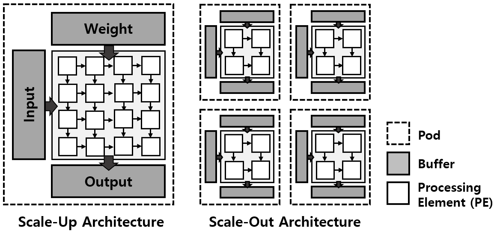

# NPU Analytical Model

A research simulator that accelerates NPU (Neural Processing Unit) simulation through **analytical modeling** and **redundant simulation skipping**. Instead of cycle-accurate simulation, it directly computes runtime, on-chip buffer accesses, and off-chip memory accesses using closed-form equations, and reuses cached results for layers and pod partitions that share the same shape.

For a detailed design document, see [`analytical_modeling/Simulation_Acceleration (KR Guide).pdf`](analytical_modeling/Simulation_Acceleration%20(KR%20Guide).pdf).

## Key Acceleration Ideas

1. **Analytical modeling** — Given a layer's GEMM dimensions (M, N, K) and hardware parameters (systolic array size, buffer sizes, dataflow), all performance metrics are derived analytically. This eliminates the need to generate cycle-level traces, making it practical to evaluate large models such as GPT-3 and PaLM in a short amount of time.
2. **Redundant layer skipping** — As layers are processed sequentially, results are cached in `layer_result_table` keyed by the `(M, N, K)` tuple. When the same shape reappears, the cached result is returned immediately without re-running the simulation.
3. **Redundant pod-partition skipping** — After scale-out partitioning, each pod's MNK sub-problem is also cached in `pod_result_table`. Identical partition shapes across different layers or pods are simulated only once.

See `skip_redundant_layer`, `skip_redundant_pod`, and `do_simulation` in [`analytical_modeling/accelerator_level_setup.py`](analytical_modeling/accelerator_level_setup.py) for the implementation.

## Architecture Model

<!-- TODO: insert architecture diagram -->


- **Scale-out** (across pods): A layer's workload is evenly partitioned across a `pod_row × pod_col` mesh of pods ([`accelerator_level_setup.py:248`](analytical_modeling/accelerator_level_setup.py#L248) `scale_out_partitioning`).
- **Scale-up** (within a pod): Each pod contains a `sa_row × sa_col` systolic array. Runtime, buffer accesses, and off-chip accesses are computed analytically based on the dataflow ([`scale_up_sim.py`](analytical_modeling/scale_up_sim.py)).
- **Dataflow**: Three modes are supported — `OS` (Output Stationary), `WS` (Weight Stationary), and `IS` (Input Stationary). The partitioning dimension and access equations vary accordingly.

## Directory Structure

```
analytical_modeling/
├── simulation.py                  # Entry point: parses args and calls accelerator.do_simulation()
├── accelerator_level_setup.py     # Topology/HW parsing, scale-out partitioning, redundancy cache
├── scale_up_sim.py                # Per-pod analytical model (runtime / buffer / off-chip)
├── run_sim.sh                     # Example run script
├── config/                        # Hardware configuration files (.cfg)
│   ├── ex_mnk_{os,ws,is}.cfg      # Example configs for each dataflow
│   ├── tpuv4_1x4.cfg              # TPUv4-like configuration
│   ├── DDR4/, HBM2/               # Memory-system-specific configs
│   └── ...
├── topology/                      # Workload topology files (.csv)
│   ├── microbench/                # Microbenchmarks (GEMM, Conv)
│   ├── BERT_Large/, GPT-3/, VIT/  # Layer-wise GEMM per model
│   ├── recent_models/             # Sub-layer topologies for BERT/GPT3/PaLM/T5
│   └── conv_nets/                 # CNNs (e.g., AlexNet)
└── results/                       # Simulation output CSVs
```

## Input Format

### Topology (`-t`, CSV)

- **GEMM** (`-i gemm`, default): `layer_name, M, N, K`
  ```
  MH_get_Q_head512,512,64,1024
  ```
- **Conv** (`-i conv`): `layer_name, IW, IH, FW, FH, C, NF, stride` — converted to GEMM (MNK) internally via [`accelerator_level_setup.py:24`](analytical_modeling/accelerator_level_setup.py#L24) `conv_to_mnk`.

### Hardware Config (`-c`)

```
[NPU_others]
pod_dimension_row: 4
pod_dimension_col: 2
clock_frequency: 1050       # MHz
bandwidth: 10000            # GB/s
latency: 1
dataflow: WS                # OS | WS | IS

[NPU_systolic]
row: 32                     # Systolic array rows
col: 32                     # Systolic array columns
input_buffer: 64            # KB (converted to bytes internally)
weight_buffer: 64           # KB
output_buffer: 64           # KB
```

See [`accelerator_level_setup.py:83`](analytical_modeling/accelerator_level_setup.py#L83) `setup_hw` for the parsing logic.

## Running

```bash
cd analytical_modeling

python3 simulation.py \
    -t topology/microbench/microbenchmark.csv \
    -c config/ex_mnk_ws.cfg \
    -i gemm
```

Or use the example script:

```bash
bash run_sim.sh
```

### Arguments

| Flag | Description |
|------|-------------|
| `-t` | Path to the topology CSV (required) |
| `-c` | Path to the hardware config file (required) |
| `-i` | Input type: `gemm` (= `mnk`, default) or `conv` |

## Output

Results are saved to `results/<topology_name>/<config_name>_results.csv` with one row per layer.

| Column | Description |
|--------|-------------|
| `Layer` | Layer index in the topology |
| `Runtime` | Execution cycles for the layer (maximum across pods, assuming parallel execution) |
| `Input Buffer Access` | On-chip input buffer access count |
| `Weight Buffer Access` | On-chip weight buffer access count |
| `Output Buffer Access` | On-chip output buffer access count |
| `Input Off-chip Access` | Off-chip input memory access count |
| `Weight Off-chip Access` | Off-chip weight memory access count |
| `Output Off-chip Access` | Off-chip output memory access count |

Runtime is the maximum across all pods (parallel execution assumed); all other access counts are summed across pods. See [`accelerator_level_setup.py:391`](analytical_modeling/accelerator_level_setup.py#L391) `save_results` for output path logic.

## Simulation Flow

1. `simulation.py` — Parses CLI arguments, instantiates `accelerator`, calls `do_simulation()`, and prints elapsed time.
2. `setup_topo` — Reads the topology CSV and normalizes each entry into an `(M, N, K)` triple (Conv layers are converted via im2col-style transformation).
3. `setup_hw` — Loads pod, systolic array, and buffer parameters from the `.cfg` file.
4. `do_simulation` — For each layer:
   - Queries `skip_redundant_layer`; returns cached result on hit.
   - Partitions the layer across pods via `scale_out_partitioning`.
   - For each pod partition, queries `skip_redundant_pod`; on miss, runs `do_scale_up_simulation`.
   - Aggregates pod results (max for runtime, sum for all other metrics) into the layer result.
5. `save_results` — Writes the per-layer results to CSV.

## Supported Workloads

- **Transformer models**: BERT-Large, GPT-3 (175B), PaLM, T5 — topologies provided per sequence length and sub-layer (attention / concat / FF1 / FF2)
- **Vision Transformer**: ViT-base (49 / 196 patches)
- **CNN**: AlexNet
- **Microbenchmarks**: Simple GEMM / Conv cases, and a repetitive-layer case (`microbenchmark_part_repetitive.csv`) for testing redundancy skipping

## Requirements

- Python 3.10+
- `numpy`

```bash
pip install numpy
```
